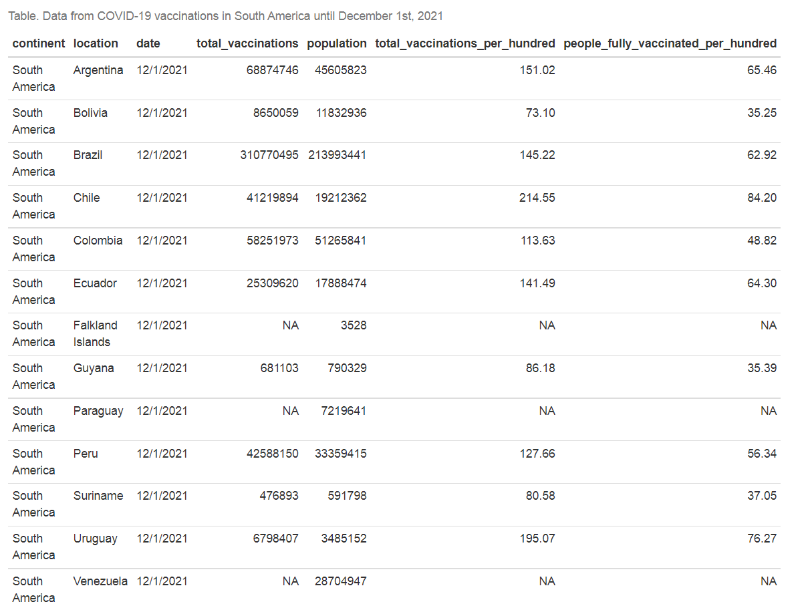
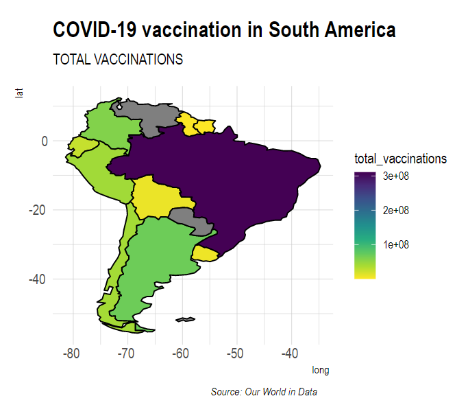
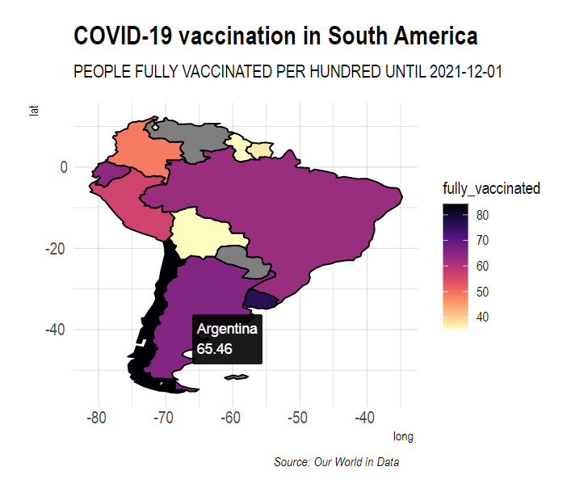
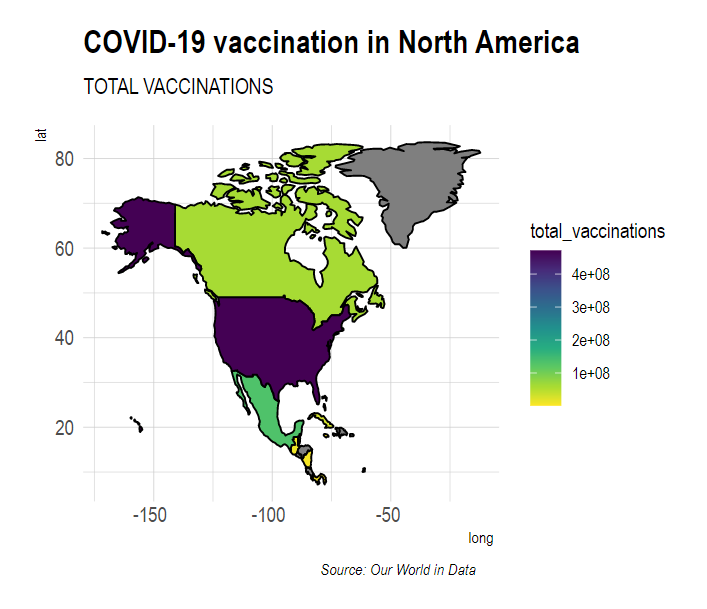
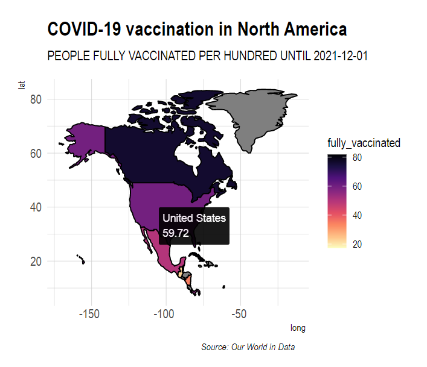

# COVID-19 vaccination in America: Project Overview 
* Report to show COVID-19 vaccination in America until December 1st, 2021 using data from [Our World in Data](https://github.com/owid/covid-19-data/tree/master/public/data/vaccinations).

## Code and Resources Used 
**R Version:** 3.6.3  
**R Markdown Notebook**
**Packages:** knitr, rnaturalearth, dplyr, sf, ggplot2, ggiraph, hrbrthemes, colormap

## Dataset

Data was collected from [Our World in Data](https://github.com/owid/covid-19-data/tree/master/public/data/vaccinations). America was the continent analyzed. Data correspond to December 1st, 2021. Columns content:

* `continent`: name of the continent.
* `location`: name of the country (or region within a country).
* `date`: date of the observation (2021-12-01).
* `total_vaccinations`: total number of doses administered. For vaccines that require multiple doses, each individual dose is counted. If a person receives one dose of the vaccine, this metric goes up by 1. If they receive a second dose, it goes up by 1 again. If they receive a third/booster dose, it goes up by 1 again.
* `population`: total population.
* `total_vaccinations_per_hundred`: total number of COVID-19 vaccination doses administered per 100 people in the total population
* `people_fully_vaccinated_per_hundred`: total number of people who received all doses prescribed by the vaccination protocol per 100 people in the total population.

## Analysis and interactive plots

Geospatial data from rnaturalearth was used. First, an America spatial object was created and attributes on total vaccinations or people fully vaccinated per hundred were joined. For these tasks, sf and dplyr packages were used. For interactive plots, ggplot2 and ggiraph R libraries were used. hrbrthemes and colormap packages was also used for themes and plot color aesthetics.

# South America

## Total vaccinations

In South America, Brazil was the country with the highest total vaccines applied (310M). In second place came Argentina (68M) and the third place went to Colombia (58M).

## People fully vaccinated per hundred

The total number of people who received all doses prescribed by the vaccination protocol per 100 people in the total population was analyzed. Chile accounted 84 people fully vaccinated per 100 and was the country with the highest score. Uruguay (76) and Argentina (65) went next. From the countries with data, Bolivia was the one with lowest score (35).

# North America

## Total vaccinations

In North America, United Stated was the country with the highest total vaccines applied (471M). In second place came Mexico (132M) and the third place went to Canada (60M).

## People fully vaccinated per hundred

In North America the total number of people who received all doses prescribed by the vaccination protocol per 100 people in the total population was also analyzed. Cuba accounted 82 people fully vaccinated per 100 and was the country with the highest score. Canada (76) and Aruba (73) went next. From the countries with data, Jamaica was the one with lowest score (17).

